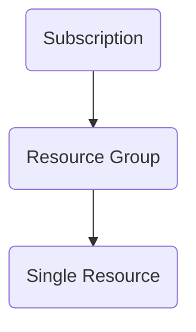

# Notes
RBAC
: Role-Based Access Control

* Follow principal of least privelege

## Scopes (Most Access to Least)
- Subscription
- Resource Group
- Single Resource



## Security Principals
User
: Individual who has a profile in Azure AD. Can be assigned to users in other tenants

Group
: Set of users created in Azure AD.

Service Principal
: Security ID used by apps and services to access specific Azure resources

Managed Identity
: Identity in Azure AD that is automatically managed by Azure. Ex: Azure Key Vault, VMs

## General Roles
Contributer
: can create/manage all resources. CANNOT grant access

Owner
: has full access to all resources and grant access

Reader
: can view existing resources

User Access Administrator
: can manage user access to Azure resources

### Deny Assignments
- Block users from performing actions

## Useful commands

```PowerShell
Get-AZRoleAssignment

# Lists Azure RBAC role assignments at the specified scope. 
# By default it lists all role assignments in the selected Azure subscription. 
```

```PowerShell
New-AZRoleAssignment -SignInName $userSignin `
    -RoleDefinitionName $roleDefinitionName `
    -ResourceGroupName $resourceGroupName

# Adds role assignment to specified user
```
```PowerShell
Get-AZRoleDefinition

# Lists all Azure RBAC roles that are available for assignment.
```
```PowerShell
New-AZRoleDefinition

# Creates a custom role in Azure RBAC. 
# Provide either a JSON role definition file or a PSRoleDefinition object as input. 
# First, use the Get-AzRoleDefinition command to generate a baseline role definition object. 
# Then, modify its properties as required. 
# Finally, use this command to create a custom role using role definition.
```

## Custom Role
Required properties
| Property | Type | Description |
| -- | --- | --- |
| Name | String | Display Name |
| ID | String | Unique ID | 
| IsCustom | String | True for custom | 
| Description | String | Max 1024 chars |
| Actions | String[] | Array of actions |
| AssignableScopes | String[] | Array of scopes|

## Role Action Examples
| Operating String | Action |
| -- | -- |
| */read | Grants read access to all resource types of all resource providers |
| Microsoft.compute/* | Grants access to all operations for all resource types in the Microsoft.Compute resource provider | 
| microsoft.web/sites/restart/Action | Grants access to restart a web app |

### Creating a custom role
```PowerShell
# Grab role definition
$role = Get-AzRoleDefinition "Virtual Machine Contributor"

$role.Id = $null

# Assign name and description
$role.Name = "VM Reader"
$role.Description = "Can see VMs"

# Clear actions and add custom actions
$role.Actions.Clear()
$role.Actions.Add("Microsoft.Storage/*/read")need
$role.Actions.Add("Microsoft.Network/*/read")
$role.Actions.Add("Microsoft.Compute/*/read")

# Clear and add own assignable scope
$role.AssignableScopes.Clear()
$role.AssignableScopes.Add("/subscriptions/0000-1111-2222-aaaa-123456778")

# Add the custom role
New-AZRoleDefinition -Role $role

```
# Links

[What is Azure RBAC](https://docs.microsoft.com/en-us/azure/role-based-access-control/overview)
